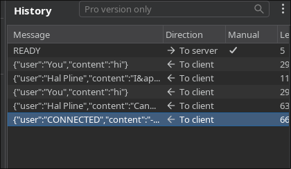
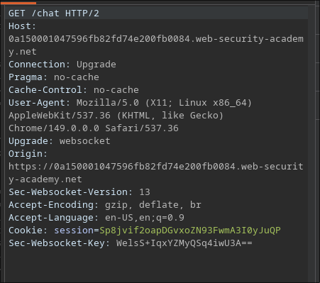
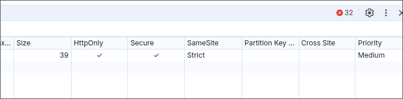
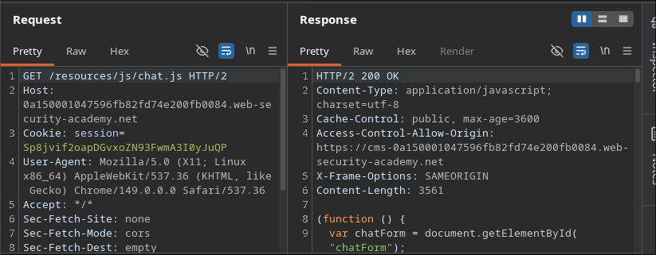
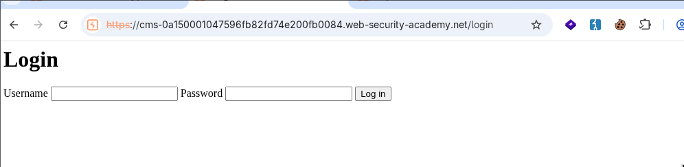
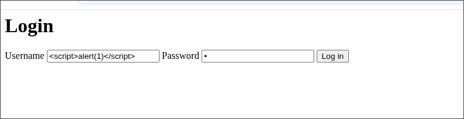
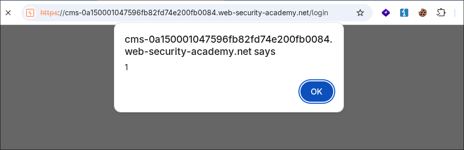
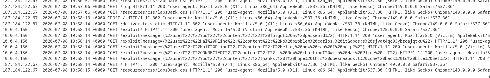
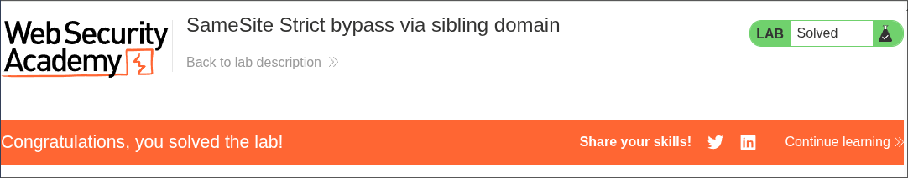

# PortSwigger Lab: SameSite Strict bypass via sibling domain

**Platform:** PortSwigger Web Security Academy  
**Difficulty:** Hard  
**Type:** WebSocket Security + SameSite Bypass  
**Objective:** CSWSH exfiltration via sibling domain XSS bypass  
**Attack Result:** Credentials extracted and account compromised

---

## Attack Flow

```
SameSite=Strict blocks CSWSH
→ Find sibling domain in HTTP history
→ Discover XSS on sibling domain
→ Sibling = same-site (eTLD+1) so SameSite allows cookie
→ Execute CSWSH from sibling (cookie included)
→ READY message dumps chat
→ Fetch exfiltrates to attacker server
→ Extract credentials → Account takeover
```

---

## 1. WebSocket Chat Discovery



READY message dumps all previous chat messages.

This is the key to exfiltration.

---

## 2. WebSocket Handshake



No CSRF token in handshake. Only session cookie.

Vulnerable to CSRF but SameSite=Strict blocks cross-site.

---

## 3. Cookie Protection



Session cookie: `SameSite=Strict`

Cross-site requests cannot include it.

Normal CSWSH won't work.

---

## 4. Sibling Domain Discovery



Found in HTTP history:

```
GET /resources/js/chat.js HTTP/2
Host: cms-0a150001047596fb82fd74e200fb0084.web-security-academy.net
```

**Sibling domain:** `cms-0a150001047596fb82fd74e200fb0084.web-security-academy.net`

---

## 5. Accessing Sibling Domain



Navigate to sibling domain login page.

---

## 6. XSS Vulnerability



Input in username field:

```html
<script>alert(1)</script>
```

---

## 7. XSS Confirmed



XSS vulnerability confirmed on sibling domain.

Can execute arbitrary JavaScript.

---

## 8. Exploit Payload

```html

```

**Why it works:**
1. XSS executes on sibling domain (same-site context)
2. SameSite=Strict allows cookie (same-site = eTLD+1)
3. WebSocket connection includes session cookie
4. READY message dumps chat history
5. Fetch sends each message to attacker server

---

## 9. Victim Access Log



Victim's browser fetches to attacker server with chat data:

```
GET /exploit?message={"user":"You","content":"I forgot my password"}
GET /exploit?message={"user":"Hal Pline","content":"No problem carlos, it's sjvat4qc93ybreajqtxu"}
GET /exploit?message={"user":"Hal Pline","content":"Hello, how can I help?"}
```

**Extracted credentials:**
```
User: carlos
Password: sjvat4qc93ybreajqtxu
```

---

## 10. Account Login

Navigate to `/login` on main domain:

```
Username: carlos
Password: sjvat4qc93ybreajqtxu
```

---

## 11. Lab Solved



---

## SameSite=Strict Bypass Explained

### The Problem
- Main domain: `0a150001047596fb82fd74e200fb0084.web-security-academy.net`
- Attacker: `exploit-server.net`
- These are different sites → SameSite=Strict blocks cookie

### The Solution
- Sibling domain: `cms-0a150001047596fb82fd74e200fb0084.web-security-academy.net`
- Both share eTLD+1: `web-security-academy.net`
- They're the **same-site** at cookie level
- XSS on sibling = code execution in same-site context
- Cookie **is included** despite SameSite=Strict

---

## Key Concepts

### eTLD+1 (Effective Top-Level Domain + 1)

Cookies are checked at eTLD+1 level for SameSite:
- `cms-example.com` and `www-example.com` = same site
- `example.com` and `other.com` = different sites
- Subdomains are same-site for cookie purposes

### Sibling Domain Exploitation

If subdomain has XSS or CSRF vulnerability, attacker can:
1. Execute code on subdomain (same-site context)
2. Access parent domain resources (same-site)
3. Bypass SameSite=Strict protection
4. Include sensitive cookies in requests

---

## Why It Works

- **XSS on sibling:** Code executes same-site
- **Same-site = eTLD+1:** Both subdomains under same domain
- **SameSite check:** Only blocks cross-site, not same-site
- **Cookie included:** Browser includes session cookie (same-site)
- **READY exploit:** Dumps chat on demand
- **Fetch exfiltration:** Sends to attacker server

---

## Attack Chain

1. Discover READY message leaks chat
2. Find SameSite=Strict blocks CSWSH
3. Discover sibling domain in HTTP history
4. Test for XSS on sibling domain
5. Chain XSS + sibling domain = same-site context
6. Execute CSWSH from sibling (cookie included)
7. Exfiltrate chat history
8. Extract credentials
9. Login to victim account

---

## References

- [PortSwigger — CSWSH](https://portswigger.net/web-security/websockets/cross-site-websocket-hijacking)
- [PortSwigger — SameSite Cookies](https://portswigger.net/web-security/csrf/samesite-cookies)
- [MDN — eTLD+1](https://wiki.mozilla.org/Public_Suffix_List)
- [OWASP — XSS Prevention](https://cheatsheetseries.owasp.org/cheatsheets/Cross_Site_Scripting_Prevention_Cheat_Sheet.html)
