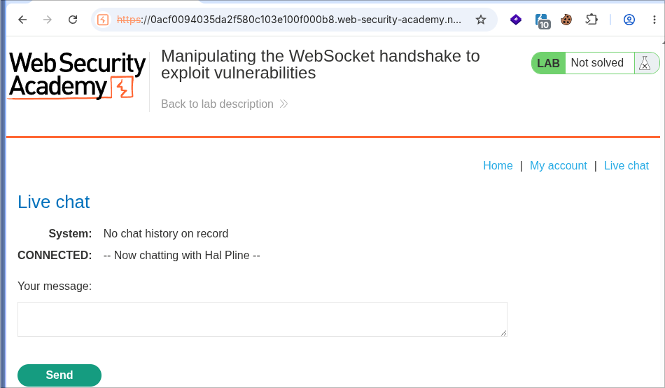
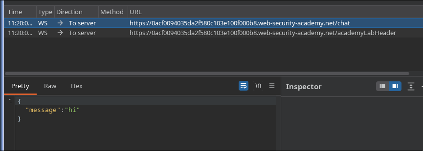
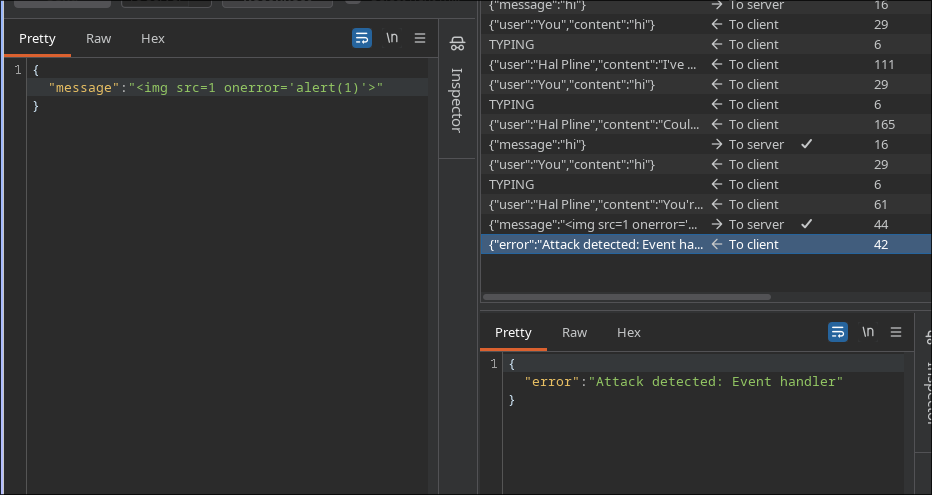
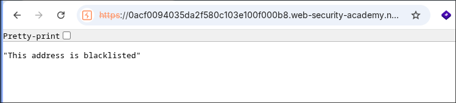
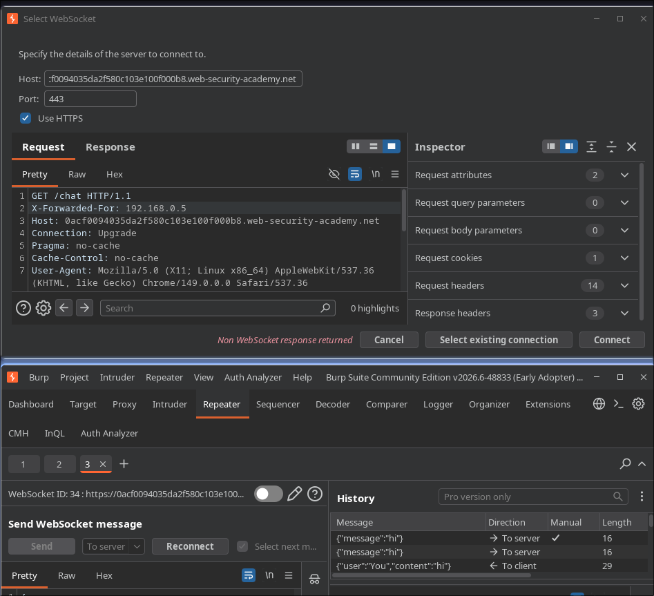
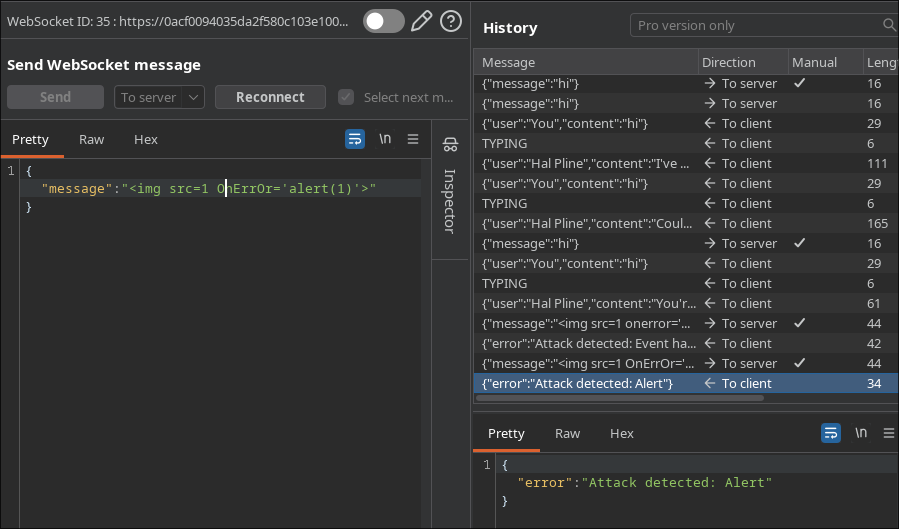
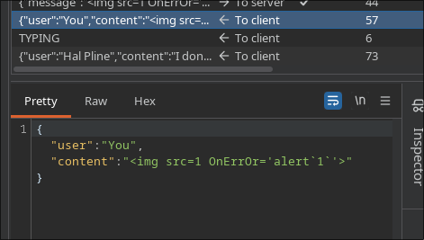
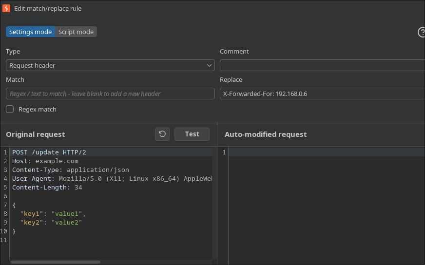
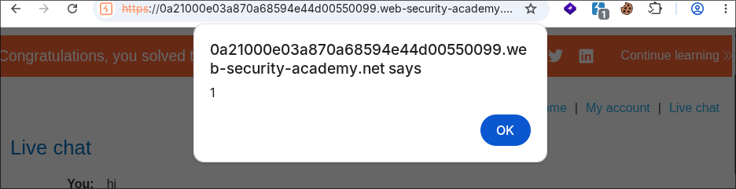

# PortSwigger Lab: Manipulating the WebSocket handshake to exploit vulnerabilities

**Platform:** PortSwigger Web Security Academy  
**Difficulty:** Medium  
**Type:** WebSocket Security with Filter Bypass  
**Objective:** Inject XSS into WebSocket despite aggressive XSS filter  
**Key Bypasses:** X-Forwarded-For header, case variation, backtick injection

---

## Attack Flow

```
Live chat WebSocket → Send normal message
→ Capture and try XSS payload → Filter blocks (IP blacklisted)
→ Use X-Forwarded-For header to spoof IP
→ Reconnect WebSocket with new spoofed IP
→ Send payload with case variation + backticks
→ Filter bypassed, alert() executed
```

---

## 1. Live Chat Interface



Standard WebSocket chat with support agent (Hal Pline).

```
System: No chat history on record
CONNECTED: -- Now chatting with Hal Pline --
Your message: [input field]
```

---

## 2. WebSocket Message Capture



Normal message sent via WebSocket:

```json
{
  "message": "hi"
}
```

Captured in Burp WebSocket tab.

---

## 3. First XSS Attempt

Send to Repeater:

```json
{
  "message": ""
}
```

---

## 4. Filter Detection



Aggressive XSS filter detects and blocks:

```json
{
  "error": "Attack detected: Event handler"
}
```

Filter blocks event handlers like `onerror`.

---

## 5. IP Blacklisted



After sending malicious payload:

```
"This address is blacklisted"
```

Your IP is now blacklisted. Cannot send more messages.

---

## 6. Bypass Method: X-Forwarded-For Header



To bypass IP blacklist, use **X-Forwarded-For header** to spoof client IP.

Server thinks request comes from different IP address.

Connection details:
```
Host: 0acf0094035da2f580c103e100f000b8.web-security-academy.net
Port: 443
Use HTTPS: ✓
```

---

## 7. Case Variation Bypass



Randomize case to bypass filter:

```json
{
  "message": ""
}
```

Change `onerror` → `OnErrOr` (case variation)

Filter still blocks (too aggressive).

---

## 8. Backtick Injection



Use backticks instead of parentheses:

```json
{
  "message": ""
}
```

Template literal syntax: `` alert`1` `` is valid JavaScript

Filter looks for `(` and `)` but not backticks.

**Result:** Payload bypasses filter, reaches agent's browser.

---

## 9. Burp Match and Replace Configuration



To avoid manual reconnection each time:

Burp Suite: Proxy → Match and Replace

Add rule:
```
Type: Request header
Match: (leave empty)
Replace: X-Forwarded-For: 192.168.0.6
```

This automatically adds spoofed IP to every request.

---

## 10. Lab Completed



Alert popup with value `1` appears.

Support agent's browser executes:

```javascript
alert`1`  // Backtick syntax bypassed filter
```

```
Congratulations, you solved the lab!
```

---

## Filter Bypass Layers

| Layer | Protection | Bypass Method |
|-------|-----------|---------------|
| **IP Blacklist** | Server blocks IP | X-Forwarded-For header |
| **Event Handler** | Filter blocks `onerror` | Case variation: `OnErrOr` |
| **Function Call** | Filter blocks `alert(1)` | Backticks: `` alert`1` `` |

---

## Why It Works

- **X-Forwarded-For trusted:** Server assumes proxy headers legitimate
- **Case-sensitive filters:** Simple string matching doesn't account for case
- **Template literals overlooked:** Backticks are valid syntax but rarely filtered
- **No rate limiting:** Can reconnect unlimited times with different IPs
- **WebSocket less strict:** Server trusts WebSocket more than HTTP

---

## Key Techniques

### X-Forwarded-For Header
```
Original IP: 192.168.1.100
Header: X-Forwarded-For: 10.0.0.1
Server thinks: 10.0.0.1 made request
```

### Template Literals in JavaScript
```javascript
alert(1)      // Normal function call
alert`1`      // Template literal (same result, different syntax)
alert`1${2}`  // Can include expressions in backticks
```

---

## References

- [PortSwigger — WebSocket](https://portswigger.net/web-security/websockets)
- [MDN — X-Forwarded-For Header](https://developer.mozilla.org/en-US/docs/Web/HTTP/Headers/X-Forwarded-For)
- [JavaScript Template Literals](https://developer.mozilla.org/en-US/docs/Web/JavaScript/Reference/Template_literals)
- [XSS Prevention](https://cheatsheetseries.owasp.org/cheatsheets/Cross_Site_Scripting_Prevention_Cheat_Sheet.html)
